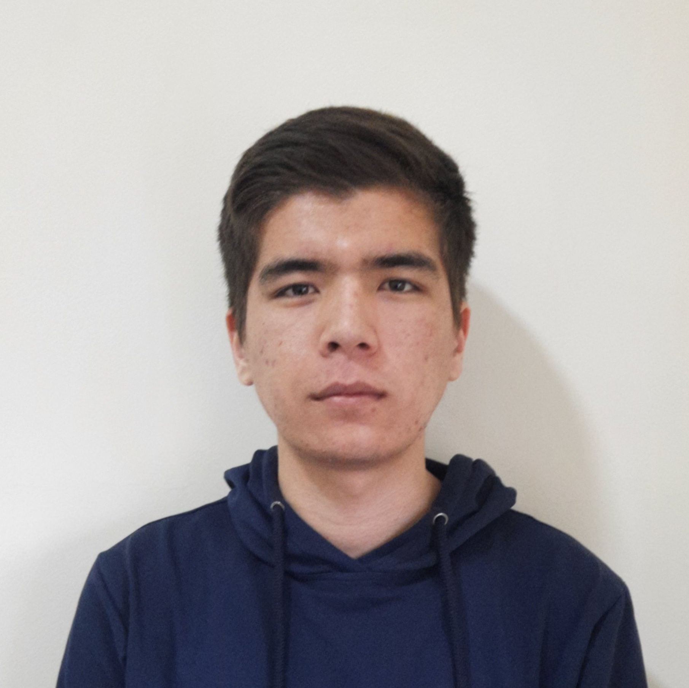

# CV | RSSchool

## Umidullo, Suyunov

## Contacts

<ul style="list-style-position:inside;">
	<li>Phone: <a href="tel:+997970012602">+998(97) 001-26-02</a></li>
	<li>Telegram: <a href="https://t.me/umidullo">@umidullo</a></li>
	<li>Email: <a href="mailto:suyunovumidullo@gmail.com">suyunovumidullo@gmail.com</a></li>
	<li>Discord: umidullo#1414</li>
</ul>

## Summary

Polite and enthusias.c, I am interested in IT and everything in its orbit. For the last year and a half, I have started to get involved in web programming, such as applica.on development and website development (par.cipated in three small commercial projects). I am looking for a company willing to offer me a place among their developers. In return, I would offer all my commitments and will be a nice and friendly addi.on to your team. Therefore, I am currently looking for a job or
internship as a front-end developer. My goal is to create soEware tailored to the needs of the user, to create applica.ons with a convenient and intui.ve user interface. I also understand the importance of crea.ng readable and maintainable source code. I am constantly striving to learn new technologies and looking for ways to improve myself in this rapidly changing industry. In the coming years, I want to gain enough experience to launch and manage my projects.

## Skills

##### Languages

- HTML
- CSS,SCSS
- JavaScript(ES5,ES6)
- TypeScript

##### Version Vontrol System

- Git

##### Frameworks/Libraries

- React(learning)

##### Tools

- Webpack
- VS Code
- Webstorm
- Github
- Figma, AdobeXD

##### Platforms

- Mac OS
- Windows

## Code examples

- Codewars [@umidullo](https://www.codewars.com/users/umidullo)
- Github [@umidullo](https://github.com/umidullo)

## Experience (commercial)

### Masshtab proyect-stroy (architecture company) _(2021-02 — current)_

#### Web developer

- Created a wonderful UI for a corporate website

## Experience (student projects)

- _SPA_ [English-for-kids](https://umidullo-english-for-kids.netlify.app/) platform to learn words (_React_)

- _SPA_ [match-match](https://rolling-scopes-school.github.io/umidullo-JSFE2021Q1/match-match/) game (_TypeScript_)

- _MPA_ [Online zoo](https://rolling-scopes-school.github.io/umidullo-JSFE2021Q1/online-zoo/pages/landing/index.html) about pets(dogs, cats) (_HTML,SCSS,JS(ES6)_)

## Education

- Tashkent University of Information Technologies **third year student** (present days)

## Certificates

- CEFR B1 (2019-09)
- [RSSchool](https://rs.school/) JS/FE2021Q1

## English

My english level is about btw A1+ and A2
